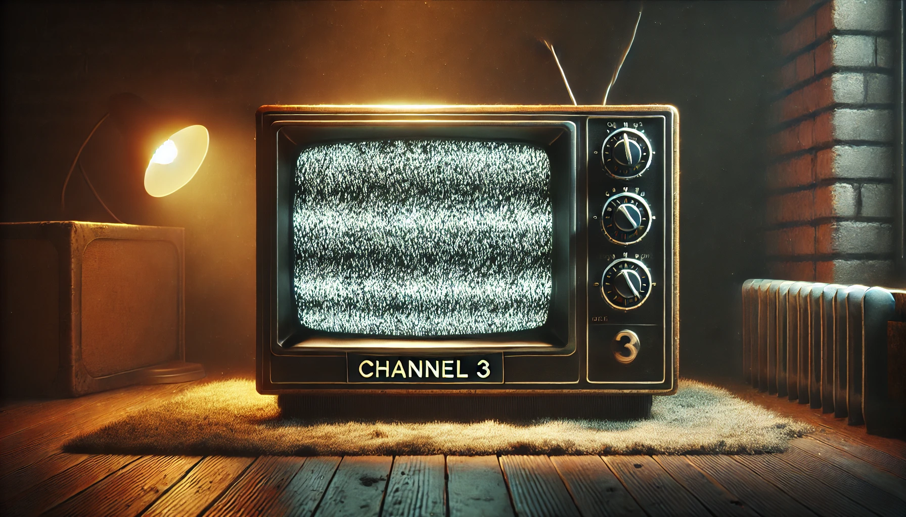

# channel3.groovy



A Groovy script for [ImageJ/Fiji](https://imagej.net/software/fiji/) that automates channel-based deconvolution, Z-projection, local maxima detection, and binary mask generation on a multi-channel image. This script uses [Bio-Formats](https://www.openmicroscopy.org/bio-formats/) for file import and the [DeconvolutionLab2](https://github.com/Biocomputing-UTech/DeconvolutionLab2) plugin for deconvolution.

---

## Table of Contents
1. [Features](#features)  
2. [Requirements](#requirements)  
3. [Installation](#installation)  
4. [Usage](#usage)  
5. [Script Parameters & Workflow](#script-parameters--workflow)  
6. [Outputs](#outputs)  
7. [Notes & Tips](#notes--tips)  
8. [License](#license)

---

## Features

- **Automated Channel Processing**: The script splits the input image into separate channels and processes each for deconvolution.
- **Deconvolution**: Uses the DeconvolutionLab2 plugin to run Richardson-Lucy deconvolution with user-specified PSF files.
- **Z-Projection**: Generates a maximum-intensity projection (MIP) for each channel.
- **Local Maxima Detection**: Identifies bright spots (maxima) in each channel, saving the coordinates for later analysis.
- **Binary Mask Creation**: Creates a binary mask from one specified channel (default: the blue channel), applying a Gaussian blur and thresholding.

---

## Requirements

1. **ImageJ or Fiji**:  
   - [Fiji](https://imagej.net/software/fiji/) is recommended because it comes bundled with many scientific image processing plugins.
2. **Groovy** (if running from a standalone environment).
3. **Bio-Formats** plugin (already included in Fiji) for reading various image file formats (e.g., `.czi`, `.nd2`, etc.).
4. **DeconvolutionLab2** plugin installed in ImageJ/Fiji.  
   - [Installation instructions](https://github.com/Biocomputing-UTech/DeconvolutionLab2/wiki/Install)
5. **PSF Files**: You will need point spread function (PSF) images for each channel you intend to deconvolve.

---

## Installation

1. **Download the script**  
   Save or copy the `loop_decon_z_loc_bin.groovy` file into a convenient location on your computer.

2. **(Optional) Place in Fiji Scripts folder**  
   - Open Fiji, go to **`Plugins` > `Install...`** and place the script into Fiji’s `scripts` folder, or simply store the `.groovy` file wherever you keep your scripts.

3. **Ensure DeconvolutionLab2 is installed**  
   - Download the DeconvolutionLab2 `.jar` file and place it in Fiji’s `plugins` folder if you haven’t already.

---

## Usage

1. **Launch Fiji/ImageJ**.
2. **Open the Script**:  
   - Go to **`Plugins` > `Scripts`** > locate and open `loop_decon_z_loc_bin.groovy`, or  
   - Use **`File` > `Open...`** to open the `.groovy` file, or  
   - Open it in the Fiji Script Editor (in Fiji: **`File` > `New` > `Script`** and then open the file).
3. **Run the Script**:  
   - Click the **`Run`** button (in the Script Editor) or choose **`Run`** from the menu in ImageJ.

When you run the script, it will prompt you for:

1. **Input file** (`choose input file`): The multi-channel image to be processed.  
2. **PSF folder** (`choose folder with PSF files`): The directory containing PSF `.tif` files for each channel (e.g., `red_psf.tif`, `yellow_psf.tif`, `blue_psf.tif`).  
3. **Output folder** (`choose output folder`): Where the script will save all output files.

---

## Script Parameters & Workflow

1. **Channel Definitions**  
   - By default, the script is set up to handle 4 channels:
     - Channel 0: DIC (Differential Interference Contrast)  
     - Channel 1: Red  
     - Channel 2: Yellow  
     - Channel 3: Blue  
   - The script focuses on channels `1`, `2`, and `3` for deconvolution and subsequent processing.

2. **Deconvolution**  
   - Uses DeconvolutionLab2’s Richardson-Lucy (RL) algorithm (15 iterations) for each channel (1 to 3).
   - PSF files must follow naming conventions like `red_psf.tif`, `yellow_psf.tif`, `blue_psf.tif`, stored in the selected PSF directory.

3. **Z-Projection**  
   - After deconvolution, it performs a maximum intensity projection (MIP) on each channel.

4. **Local Maxima Detection**  
   - Applies a small Gaussian blur (σ=1) to each MIP, calculates image statistics, and uses `3×(standard deviation)` as the prominence threshold for local maxima.  
   - Points are saved in a CSV file for each channel (`pointsC{channel}.csv`).

5. **Binary Mask Creation (Blue Channel)**  
   - For the final step, channel 3 (blue) is processed again.  
   - A Gaussian blur (σ=2) is applied, image is converted to 8-bit, and auto-thresholded (MaxEntropy) to produce a binary mask.  
   - The resulting mask is saved as `channel3_binaryMask.tif`.

6. **Cleanup**  
   - The script closes all images after processing is complete to keep the Fiji workspace tidy.

---

## Outputs

Inside the chosen output folder, you should find:

1. **`channelNdeconv.tif`** – Deconvolved stack for each channel (N = 1,2,3).  
2. **`channelN_maxProj.tif`** – Maximum-intensity projection for each channel (N = 1,2,3).  
3. **`pointsC{N}.csv`** – CSV files containing the (X, Y) coordinates and intensity measurements for local maxima in each channel.  
4. **`channel3_binaryMask.tif`** – Binary mask generated from the blue channel (default channel 3).

---

## Notes & Tips

- **Channel Mapping**: If your dataset does not use the default arrangement (0: DIC, 1: Red, 2: Yellow, 3: Blue), you may need to adjust the script accordingly.
- **PSF Files**: Ensure that your PSF filenames match the channel naming in the script (`red_psf.tif`, `yellow_psf.tif`, `blue_psf.tif`). Modify if needed.
- **Adjusting Parameters**: 
  - Iterations for Richardson-Lucy can be changed in the line:  
    ```groovy
    def algorithm = " -algorithm RL 15"
    ```
  - The Gaussian blur settings and threshold method can also be edited in the script if your data calls for different filters.
- **Performance**: Deconvolution can be computationally intensive. For large images or higher iteration counts, be prepared for longer processing times.

---

## License

This script is provided under the [MIT License](./LICENSE) (or insert your preferred license here). Feel free to modify and distribute as needed.

---
